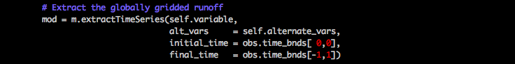

<!----- Conversion time: 8.892 seconds.

Using this Markdown file:

1. Cut and paste this output into your source file.
2. See the notes and action items below regarding this conversion run.
3. Check the rendered output (headings, lists, code blocks, tables) for proper
   formatting and use a linkchecker before you publish this page.

Conversion notes:

* gd2md-html version 1.0β10
* Fri Mar 23 2018 15:34:16 GMT-0700 (PDT)
* Source doc: https://docs.google.com/open?id=1oX8M6s36UHkJigue_DWzfjdvIDfwDTyIqjs5H-mwSQg
* This document has images: check for >>>>>  gd2md-html alert:  inline image link in generated source and store images to your server.

WARNING:
You have 5 H1 headings. You may want to use the "H1 -> H2" option to demote all headings by one level.

----->

>>>>>  gd2md-html alert:  ERRORs: 0; WARNINGs: 1; ALERTS: 15.

<ul style="color: red; font-weight: bold"><li>See top comment block for details on ERRORs and WARNINGs. <li>In the converted Markdown or HTML, search for inline alerts that start with >>>>>  gd2md-html alert:  for specific instances that need correction.</ul>

Links to alert messages:
<a href="#gdcalert1">alert1</a>
<a href="#gdcalert2">alert2</a>
<a href="#gdcalert3">alert3</a>
<a href="#gdcalert4">alert4</a>
<a href="#gdcalert5">alert5</a>
<a href="#gdcalert6">alert6</a>
<a href="#gdcalert7">alert7</a>
<a href="#gdcalert8">alert8</a>
<a href="#gdcalert9">alert9</a>
<a href="#gdcalert10">alert10</a>
<a href="#gdcalert11">alert11</a>
<a href="#gdcalert12">alert12</a>
<a href="#gdcalert13">alert13</a>
<a href="#gdcalert14">alert14</a>
<a href="#gdcalert15">alert15</a>

>>>>> PLEASE check and correct alert issues and delete this message and the inline alerts.

# ILAMB Cookbook (ILAMB ver 2.2)

2018-03-12	Ryotaro Doi and Hyungjun Kim

# 0. Installation

## (0) Built your own Python environment (Optional)

- Copy Miniconda to your directory by the following command.

$ mkdir /home/{username}/packages/

$ cp /home/hjkim/packages/Miniconda2-latest-Linux-x86_64.sh /home/{username}/packages/

- Set up Miniconda

$ bash /home/{username}/packages/Miniconda2-latest-Linux-x86_64.sh

- Add Miniconda PATH

$ vi /home/{username}/.bash_profile

(add the following line in the .bash_profile)

export PATH=/home/{username}/miniconda2/bin/:$PATH

(close .bash_profile)

- Reload .bash_profile

$ source /home/{username}/.bash_profile

- Name your new environment(you can choose other names than "pydef")

$ conda create --name pydef anaconda

Your new environment "pydef" is now ready!!

**Notes:**

"pydef" can be activated by the following.

$ source activate pydef

This can be deactivated by the following.

$ source deactivate

## (1) Install ILAMB

(Activate your own python environment before installation if you use your own environment)

ILAMB software is available on bitbucket page. Here we will download the software from bitbucket and install it on mizu.

First we need to clone the ILAMB software to your directory. Move to the directory where you would like to clone the git repository and type the command below. 

$ git clone [https://bitbucket.org/ncollier/ilamb.git](https://bitbucket.org/ncollier/ilamb.git)

Enter into the cloned directory and install ILAMB

$ cd ./ilamb

$ export PYTHONPATH=$PYTHONPATH:/home/{username}/lib/python2.7/site-packages/

$ python setup.py install --prefix=/home/{username}/

$ export PATH=/home/{username}/bin/:$PATH

Modify .bash_profile

$ vi /home/{username}/.bash_profile

(add the following lines in the .bash_profile)

export PATH=/home/{username}/bin/:$PATH

export PYTHONPATH=$PYTHONPATH:/home/{username}/lib/python2.7/site-packages/

(close .bash_profile)

$ source /home/{username}/.bash_profile

Check if ILAMB is successfully installed

(activate ipython by the following)

$ ipython --pylab

(try to import ILAMB)

$ import ILAMB

If ILAMB is successfully imported, the installation is done!

If it raises an error related to some missing modules, install them by the following.

$ conda install {package_name}

Now the ILAMB is ready!!

**Notes:**

Unzip .egg file to display the ILAMB source codes.

$ unzip /home/{username}/lib/python2.7/site-packages/ILAMB-2.2-py2.7.egg

# 1. How to run ILAMB

(Activate your own python environment before running ILAMB, if needed)

In this section, we are going to look at how we can run this software. Since this software comes with no data, some simple sample datasets are prepared in mizu. Here we are going to use the following datasets.

**Sample:**

See	 /work/a01/doi/pub/1_HowToRun/

Reference Data:	tas from GPCC dataset (1976-2005)

Model Data:		tas from MIROC5 and CanESM2

The only steps we need are:

## (1) Prepare the configure file and sample data

Copy the configure file, "cmip5_hist.cfg" in "/work/a01/doi/pub/1_HowToRun/", as well as DATA/ and MODELS/ directory to your directory. (ex. /work/a01/doi/ILAMB/HowToRun) 

(Here is an example to copy to /work/a01/doi/ILAMB/HowToRun)

$ mkdir /work/a01/doi/ILAMB/HowToRun

$ cd /work/a01/doi/pub/1_HowToRun

$ cp ./cmip5_hist.cfg /work/a01/doi/ILAMB/HowToRun

$ cp -r ./DATA/ /work/a01/doi/ILAMB/HowToRun

$ cp -r ./MODELS/ /work/a01/doi/ILAMB/HowToRun

## (2) Set ILAMB_ROOT

move to your new directory (as the example below)

$ cd /work/a01/doi/ILAMB/HowToRun

Set the environment variable, ILAMB_ROOT as follows.

$ export ILAMB_ROOT=/work/a01/doi/ILAMB/HowToRun

		(ILAMB_ROOT should point to the directory which contains the MODEL directory)

(ILAMB_ROOT can also be defined in .bash_profile if you run the ILAMB experiment several times in the same directory)

## 

## (3) Run the model evaluation

Run the study using the ilamb-run script. Executing the command in your directory:

$ ilamb-run --config cmip5_hist.cfg --model_root $ILAMB_ROOT/MODELS/ --regions global

>>>>>  gd2md-html alert: inline image link here (to images/ILAMB-Cookbook0.png). Store image on your image server and adjust path/filename if necessary.  (<a href="#">Back to top</a>)(<a href="#gdcalert2">Next alert</a>) >>>>> 

**How ILAMB experiment looks like**

This script generates a new directory of results called "_build" in your directory.To browse the results, open the _build/index.html file in any browser and you will see a webpage with a summary image in the center.

The sample result can be reached here(ID: common, PW: suimongaku):

http://hydro.iis.u-tokyo.ac.jp/~doi/ILAMB/HowToRun/_build/

Notes

Please refer to the ILAMB Documentation for detailed explanations at [http://climate.ornl.gov/~ncf/ILAMB/docs/index.html#](http://climate.ornl.gov/~ncf/ILAMB/docs/index.html#) (accessed on 2018-01-16)

In the next page, we are going to look at some important points you should know when you add new datasets or evaluate your own model results.

When you run ILAMB on your datasets, you need to prepare the reference datasets and the model result datasets with the predefined structure and modify the configure file.

(Please refer to the ILAMB Document for the detailed instruction.)

Here we are going to call your attention to some important points for the installation of new datasets.

**File Format:**

ILAMB only takes NetCDF files as the input. The Variable class calls the function FromNetCDF4 in ilamblib.py to read the NetCDF files.

**Required variables:**

In the input NetCDF files, time, lat(latitude), lon(longitude) variables are always required. (It doesn't matter if it's spatial or non-spatial data.) However, time_bnds, lat_bnds, and lon_bnds are not necessary. (bnds = bounds)

 

 About the target variable data, the variable's name has to be the same with the one defined in the configure file.

**Comparison of spatial and non-spatial data:**

In the ILAMB terminology, spatial means the latitude-latitude gridded data and non-spatial means the time-series of data at some scattered locations, such as global river discharge data. ILAMB uses a flag generated inside MakeComparable function in ilamblib.py module to handle this information. For the comparison of spatial and non-spatial data, if the reference data is non-spatial and the model result data is spatial, ILAMB extract the corresponding point data from the model result in order to make them comparable. However, ILAMB doesn't work if the reference data is spatial and the model result data is non-spatial.

**Time stamp:**

Time variables in the input netCDF files have to have "units" and "calendar" attributes, but If the calendar attribute is not given, ILAMB assumes that the calendar is "365_day". If the "time_bounds" variable is not set in the netCDF file, ILAMB simply uses the mid-point of each time step as "time_bounds". 

Inside ILAMB, the unit of time is automatically shifted to "days since 1850-1-1".

The reference data and the model result data should have the same number of timesteps in the evaluation time period. ILAMB slices out the time-series from the reference and the model results, and then check if they have the same number of length for the time dimension. If they don't, ILAMB raises the error message, "Datasets have differing numbers of time intervals".

**How to handle latitude and longitude variables:**

Inside ILAMB, 	longitude variable will be rolled and converted to the value [-180 to 180]. Latitude will not be converted, but the difference of latitude variable between the reference and the model results will be solved through the il.ComposeSpatialGrids and Variable.interpolate functions.

**Comparison between daily and monthly data:**

ILAMB expects monthly input datasets. It requires considerable attention for the evaluation of daily data.

Reference(daily) vs Model(daily):

ILAMB can work only when both variables have the same tCalendar.

Evaluation will only be conducted on bias, spatial distribution, and RMSE metrics.

Interannual variability and Seasonal Cycle metrics will be skipped.

Reference(daily) vs Model(monthly):	

ILAMB doesn't work on this.

This raises VarNotComparable Error from makeComparable function.

Reference(monthly) vs Model(daily):

Model result data will be coarsened to monthly timestep.

As a result, monthly value evaluation will be conducted.

**Derived Variable:**

ILAMB can combine multiple variables into one as post-processing. In order to use this function, "derived" option should be set in configure file as follows.(The following shows an example of evaluating the sum of two variables: "snw" and "mrso".

>>>>>  gd2md-html alert: inline image link here (to images/ILAMB-Cookbook1.png). Store image on your image server and adjust path/filename if necessary.  (<a href="#">Back to top</a>)(<a href="#gdcalert3">Next alert</a>) >>>>> 

 \
 \

# 2. How to use a custom confrontation (ConfKDEPSS)

In the ILAMB terminology, a confrontation is to stage an observational benchmark dataset and its reference analysis. The Confrontation base class performs the mean-state comparison by default. However, ILAMB also supports confrontation classes which derive from the base class in case that users want to write their own comparison, or to have benchmark datasets to be compared to a non-algebraic combination of model results.

If you want to modify some of the evaluation method or replace some of the scoring metrics inside ILAMB, the best way to achieve this is by using a customized confrontation

class.

ILAMB package already provides some examples of custom Confrontation, such as ConfTWSA.py, by default. However, here we will explain how we can use a customized confrontation class, using our original ConfKDEPSS class.

ConfKDEPSS stands for Confrontation class using Perkins' Skill Score based on Kernel Density Estimation. This custom Confrontation replaces RMSE scoring metric, which is one of the five standard metrics in ILAMB, with Perkins' Skill Score metric. We will not go into the detail here, but the concept of Perkins' Skill Score is explained in the paper below.

_Perkins, S. E., Pitman, A. J., Holbrook, N. J., & McAneney, J. (2007). Evaluation of the AR4 climate models' simulated daily maximum temperature, minimum temperature, and precipitation over Australia using probability density functions. Journal of Climate. https://doi.org/10.1175/JCLI4253.1_

**Sample:**

See	 /work/a01/doi/pub/2_ConfCustom/

Reference Data:	pr from GPCC dataset (1976-2000)

Model Data:		pr from MIROC5 and CanESM2

## (1) Prepare the configure file and sample data

Copy the configure file, "cmip5_hist_customConf.cfg" in "/work/a01/doi/pub/2_ConfCustom/", as well as DATA/ and MODELS/ directory to your directory. 

(ex. /work/a01/doi/ILAMB/ConfCustom) 

If you open the configure file, you can see the text below.

We use "ctype" to select which Confrontation to apply. Here we set this to "ConfKDEPSS".

If ctype is not given, ILAMB uses the base class of Confrontation by default.

>>>>>  gd2md-html alert: inline image link here (to images/ILAMB-Cookbook2.png). Store image on your image server and adjust path/filename if necessary.  (<a href="#">Back to top</a>)(<a href="#gdcalert4">Next alert</a>) >>>>> 

Notes

Since ctype is defined for each h2 level tag inside .cfg file, it is possible to use different custom confrontation for each variable. Multiple confrontations are also applicable on a single variable by defining additional h2-level tags with different ctypes.

## (2) Set Customized Confrontation

(Source directory has to be unzipped in advance. Look at  "0.Installation" section.)

Copy ConfKDEPSS.py and customKDEPSSmodule.py from the sample directory to ILAMB source directory.

$ cd /work/a01/doi/pub/2_ConfCustom/codes/

$ cp ./ConfKDEPSS.py /home/{username}/lib/python2.7/site-packages/ILAMB/

$ cp ./customKDEPSSmodule.py /home/{username}/lib/python2.7/site-packages/ILAMB/

Modify ILAMB source code.

$ cd /home/{username}/lib/python2.7/site-packages/ILAMB/

1.  Open the Scoreboard.py

		$ vi ./Scoreboard.py

1.  Add "from ConfKDEPSS import ConfKDEPSS" in Scoreboard.py as follows.

>>>>>  gd2md-html alert: inline image link here (to images/ILAMB-Cookbook3.png). Store image on your image server and adjust path/filename if necessary.  (<a href="#">Back to top</a>)(<a href="#gdcalert5">Next alert</a>) >>>>> 

1.  Add " "ConfKDEPSS": ConfKDEPSS " around line 185 in Scoreboard.py as follows.

	

>>>>>  gd2md-html alert: inline image link here (to images/ILAMB-Cookbook4.png). Store image on your image server and adjust path/filename if necessary.  (<a href="#">Back to top</a>)(<a href="#gdcalert6">Next alert</a>) >>>>> 

Save and close Scoreboard.py.

## (3) Run the model evaluation

!!This experiment takes about 5 hours!!

move to your new directory (as the example below)

$ cd /work/a01/doi/ILAMB/ConfCustom/

Set the environment variable, ILAMB_ROOT as follows.

$ export ILAMB_ROOT=/work/a01/doi/ILAMB/ConfCustom/

		(ILAMB_ROOT should point to the directory which contains the MODEL directory)

(ILAMB_ROOT can also be defined in .bash_profile if you run the ILAMB experiment several times in the same directory)

Run the study using the ilamb-run script. Executing the command in your directory:

$ ilamb-run --config cmip5_hist_customConf.cfg --model_root $ILAMB_ROOT/MODELS/ --regions global

# 3. How to make a custom confrontation(ConfKDEPSS)

In this section, we are going to look at how we can make our custom Confrontation class. As an example, we will make ConfKDEPSS class, which replaces RMSE scoring metric with Perkins' Skill Score metric.

## (1) How the Confrontation works

Before we make our own custom Confrontation, we look at how the default Confrontation class works.

(The source codes are in /home/{username}/lib/python2.7/site-packages/ILAMB/)

1) stageData

Confrontation class has stageData method. This method extracts model result data which matches the observational dataset. 

First, the observational dataset is extracted and shaped as ILAMB.Variable instance.

Then, model result is extracted.

Finally, stageData make the observational and model data comparable.

>>>>>  gd2md-html alert: inline image link here (to images/ILAMB-Cookbook5.png). Store image on your image server and adjust path/filename if necessary.  (<a href="#">Back to top</a>)(<a href="#gdcalert7">Next alert</a>) >>>>> 

2) confront

Confrontation class has confront method. This method passes the required set of data to AnalyssMeanState function.

First, the observational and model dataset are prepared using stageData method.

Then, the set of data will be passed to ilamblib.AnalysisMeanState function.

>>>>>  gd2md-html alert: inline image link here (to images/ILAMB-Cookbook6.png). Store image on your image server and adjust path/filename if necessary.  (<a href="#">Back to top</a>)(<a href="#gdcalert8">Next alert</a>) >>>>> 

3) AnalysisMeanState

ilamblib.py contais AnalysisMeanState function. (around line 800)

This function is the core of model evaluation; this function computes five meric scores and dump the results to netCDF4 files.

Note

Most of the calculations are done by methods in ILAMB.Variable class.

For examle, bias calculation in AnalysisMeanState function (around line 918) is conducted as follows. 

	

**bias = REF_timeint.bias(COM_timeint)**

			_where REF_timeint and COM_timeint are ILAMB.Variable instance for the_

    _long-term mean value of observational and model datasets, respectively._

    _bias method is defined in ILAMB.Variable class._

## (2) Make a custom confrontation

Here we are going to look at how to make our own customized confrontation.

Sample:

See	/work/a01/doi/pub/2_ConfCustom/codes/ConfKDEPSS.py

		/work/a01/doi/pub/2_ConfCustom/codes/customKDEPSSmodule.py

1) Basic concept

We use class inheritance from Confrontation. We define i) the additional pre-processing of datasets in stageData method, ii) the evaluation metrics in confront method, and iii) the additional calculation functions in a separate module.

2) Inheritance and __init__ method

When the customized class is defined, we use inheritance from Confrontation class. In the example below, we also changed the weight of scores in __init__ method; the weight for "RMSE Score" is commented out, and "Perkins' Skill Score" is added.

>>>>>  gd2md-html alert: inline image link here (to images/ILAMB-Cookbook7.png). Store image on your image server and adjust path/filename if necessary.  (<a href="#">Back to top</a>)(<a href="#gdcalert9">Next alert</a>) >>>>> 

3) stageData method

In this section, we have no change in stageData method.

4) confront method

In customized confrontation, we define most of the evaluation procedures in confront method, reffering to the AnalysisMeanState function in ILAMB.ilamblib module; the confront method in customized confrontation includes both the confront method in the base confrontation class and the MeanAnalysisState function.

In this example, we added Perkins' Skill Score calculation around line 105. (Here the pss_map variable is also a ILAMB.Variable instance.)

>>>>>  gd2md-html alert: inline image link here (to images/ILAMB-Cookbook8.png). Store image on your image server and adjust path/filename if necessary.  (<a href="#">Back to top</a>)(<a href="#gdcalert10">Next alert</a>) >>>>> 

Note

The result is dumped to netCDF4 file, based on out_vars list.(around line 180) Here the elements of out_vars list are Python dictionaries(key: region such as 'global', value: ILAMB.Variable instance).

>>>>>  gd2md-html alert: inline image link here (to images/ILAMB-Cookbook9.png). Store image on your image server and adjust path/filename if necessary.  (<a href="#">Back to top</a>)(<a href="#gdcalert11">Next alert</a>) >>>>> 

Note

When we use a customized confrontation, we need to define "ctype" in configuration file (Look at p.8) and modify Scoreboard.py (Look at p.9).

# 4. How to use other models for pre-processing(ConfTRIP)

In this section, we are going to show an example of external model reference.

TRIPy is the Total Runoff Integrating Pathways(TRIP; Oki and Sud, 1998) River Routing Model written in Python (Kim 2017).

<em>http://hydro.iis.u-tokyo.ac.jp/~sujan/research/models/trip.html</em>

Many GCMs have runoff outputs but they don't have discharge outputs in most cases. Since we only have the observational datasets on river discharge (but no runoff datasets), we need to convert the model results of runoff into discharge in order to evaluate them against the observational datasets. Here we use TRIPy as pre-processing in order to calculate river discharge from runoff.

sample:

See	/work/a01/doi/pub/4_ConfTRIPy/codes/ConfTRIPy.py

## (1) Basic concept

This time we are going to mainly change stageData, and use the standard MeanStateAnalysis function for the evaluation procedure.

## 

## (2) runTRIPy method

We added a new method, runTRIPy, to manage the Input/Output between ILAMB and TRIPy. This method passes the model dataset extracted by ILAMB to TRIPy and executes TRIPy calculation.

>>>>>  gd2md-html alert: inline image link here (to images/ILAMB-Cookbook10.png). Store image on your image server and adjust path/filename if necessary.  (<a href="#">Back to top</a>)(<a href="#gdcalert12">Next alert</a>) >>>>> 

## 

## (3) stageData method

First, the observational dataset (station data) with the shape of (time, station) is extracted and stored in ILAMB.Variable instance.

>>>>>  gd2md-html alert: inline image link here (to images/ILAMB-Cookbook11.png). Store image on your image server and adjust path/filename if necessary.  (<a href="#">Back to top</a>)(<a href="#gdcalert13">Next alert</a>) >>>>> 

Secondly, the model result (spatial data) with the shape of (time, latitude, longitude) is extracted and stored in ILAMB.Variable instance.

>>>>>  gd2md-html alert: inline image link here (to images/ILAMB-Cookbook12.png). Store image on your image server and adjust path/filename if necessary.  (<a href="#">Back to top</a>)(<a href="#gdcalert14">Next alert</a>) >>>>> 

Thirdly, the model result (global runoff map data) is passed to TRIPy, and TRIPy returns the same shape of discharge data.

>>>>>  gd2md-html alert: inline image link here (to images/ILAMB-Cookbook13.png). Store image on your image server and adjust path/filename if necessary.  (<a href="#">Back to top</a>)(<a href="#gdcalert15">Next alert</a>) >>>>> 

Then, the model result which matches the location of observational station data is extracted.

>>>>>  gd2md-html alert: inline image link here (to images/ILAMB-Cookbook14.png). Store image on your image server and adjust path/filename if necessary.  (<a href="#">Back to top</a>)(<a href="#gdcalert16">Next alert</a>) >>>>> 

Note

Sample data is in /work/a01/doi/pub/4_ConfTRIPy/

TRIPy source code (modified by doi@2018-02-20) is in /work/a01/doi/git/TRIPy/

When you use ConfTRIPy, you need to:

1.  copy ConfTRIPy to your ILAMB source directory
1.  modify Scoreboard.py in ILAMB source directory
1.  Prepare configuration file and set "ctype"
1.  set PATH to the TRIPy source code directory

		(If TRIPy doesn't work, try "$source /home/hjkim/.bash_profile")
